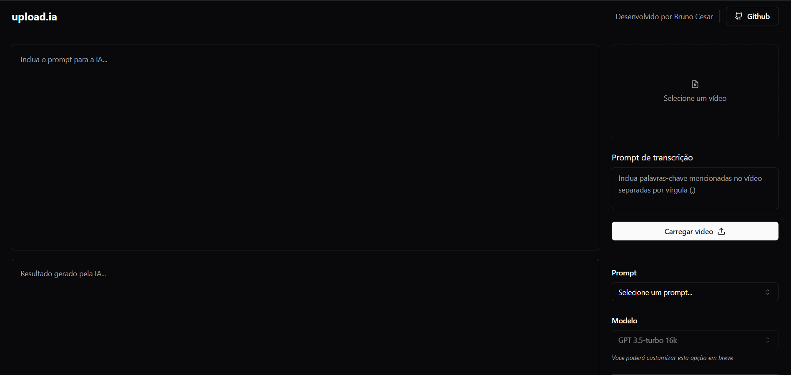

<h1 align="center">UPLOAD.AI WEB</h1>

<p align="center">
  <a href="#-descricao">Descrição</a>&nbsp;&nbsp;&nbsp;|&nbsp;&nbsp;&nbsp;
  <a href="#-demonstração">Demonstração</a>&nbsp;&nbsp;&nbsp;|&nbsp;&nbsp;&nbsp;
  <a href="#-tecnologias">Tecnologias</a>&nbsp;&nbsp;&nbsp;|&nbsp;&nbsp;&nbsp;
  <a href="#-executando-o-projeto">Como executar Frontend</a>&nbsp;&nbsp;&nbsp;|&nbsp;&nbsp;&nbsp;
  <a href="#-licença">Licença</a>
</p>

## 📜 Descrição

- Projeto para criação de memorias em timeline.

## Demonstração



## ✨ Tecnologias

Esse projeto foi desenvolvido com as seguintes tecnologias:

- [Nodejs](https://nodejs.org/en/)
- [Typescript](https://www.typescriptlang.org/)
- [Reactjs](https://pt-br.reactjs.org/)
- [Tailwind](https://tailwindcss.com/)
- [SQLite](https://www.sqlite.org/)
- [Vercel SDK AI](https://sdk.vercel.ai/docs)
- [Shadcn](https://ui.shadcn.com/)
- [Vitejs](https://vitejs.dev/)

## 🎲 Executando o Projeto

```bash
# Clone este repositório
$ git clone https://github.com/Bruno-Cesar123/upload.ai_web.git


# Acesse a pasta do projeto no terminal/cmd
$ cd upload.ai_web

# Instale as dependências
$ pnpm install

# Execute a aplicação em modo de desenvolvimento
$ pnpm run dev

# O servidor inciará na porta:5173 - acesse <http://localhost:5173/>


```
- [back-end](https://github.com/Bruno-Cesar123/upload.ai_server)

Esse projeto está sob a licença MIT. Veja o arquivo [LICENSE](license) para mais detalhes.

---

Feito por **Bruno Cesar** [**LinkedIn**](https://www.linkedin.com/in/bruno-cesar-b0039715a/)